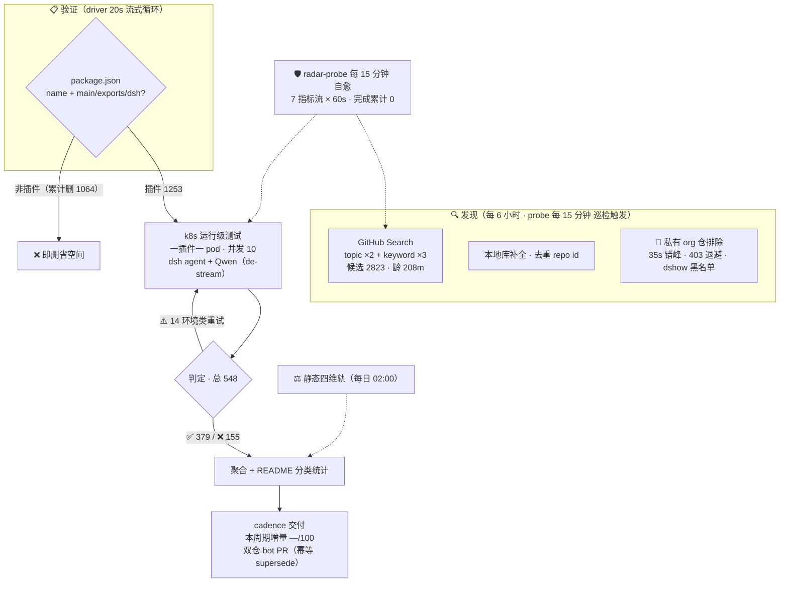

# Awesome DSH Plugins

   
  
  
  
  
  
  

**自动发现、证据验证的 DeepSeek Harness 插件生态雷达。自动发现 2800+ 候选、逐个 k8s 实测**

安装前就知道哪个能用，不用自己踩坑。

    

   

简体中文 | [English](README.en-US.md)

---

> 收录 1253 个 DSH 插件仓库（索引到2823个repos ，正由专用K8s集群，动态在DSH最新版本下验证可用性，目前高速迭代中）。

## 工作原理

> 📌 数据截至快照 `20260815T151237Z`（2026-08-15 23:12:37 UTC+8 · 分类器 unified-v2-bridge）

<!-- AUTO:pipeline:START -->

<!-- AUTO:pipeline:END -->

## 快速导航

| 你的目标 | 跳转入口 |
|---|---|
| 看热门插件 | [🔥 Star Top 20](#-热门插件star-top-20) |
| 按用途找一个插件 | [📋 分类目录](#分类目录) · [PLUGINS.md](PLUGINS.md) — 9 大功能领域 + 兼容性状态 |
| 浏览自动发现的全部仓库 | [📊 当前生态快照](#当前生态快照) — 日期化兼容矩阵 |
| 了解最近发生了什么 | [📝 CHANGELOG](CHANGELOG.md) |
| 登记或提交插件 | [🔧 给插件开发者](#给插件开发者) · 加 `dsh-plugin` topic → 8h 自动收录 · [PR 模板](.github/PULL_REQUEST_TEMPLATE.md) |
| 维护本雷达 | [⚙️ 自动化 SOP](docs/SOP.md) |
| 给插件使用者指南 | [📖 给插件使用者](#给插件使用者) |
| 本仓库如何判定兼容性 | [🔍 本仓库如何判定](#本仓库如何判定) |
| 加入社群交流 | [💬 DSH 学习社区](#-dsh-学习社区-dshfindcom) · [社区讨论群](#社区讨论群) |

> [!IMPORTANT]
> **收录不等于兼容，静态检查不等于运行可用，运行可用也不等于安全审计。**
> 本仓库提供可追溯的筛选信号，不代表 DSH 官方背书。安装第三方插件前，请检查插件源码、权限、依赖、许可证及测试日期。

## 🔥 热门插件（Star Top 20）

<!-- AUTO:featured:START -->

> 按 GitHub star 数排序，每 20 分钟自动刷新。数据截至 2026-08-16 10:17（UTC+8）。

| # | 插件 | ⭐ | 说明 |
|---|---|---|---|
| 1 | [headroom](https://github.com/headroomlabs-ai/headroom) | 66457 | Compress tool outputs, logs, files, and RAG chunks befo… |
| 2 | [dsh-web-ui](https://github.com/zhu1090093659/dsh-web-ui) | 2754 | Plugin and skin collection for DeepSeek Harness (DSH) W… |
| 3 | [modlens](https://github.com/liustack/modlens) | 1945 | The first vision plugin for DeepSeek Harness, and the v… |
| 4 | [TokenTracker](https://github.com/xiufengsun/TokenTracker) | 1323 | Local-first AI token usage & cost tracker for 31 coding… |
| 5 | [DSH-better-sidebar](https://github.com/omdsh-dev/DSH-better-sidebar) | 1295 | 一个侧边栏的完整工作台，支持三方拓展注册新侧边栏页面。内置文件渲染编辑/终端/Git/子代理 |
| 6 | [dsh-TUI](https://github.com/ccch1mneyyy/dsh-TUI) | 1288 | DSH 官方公众号收录的 TUI 补位插件：Claude Code 风，鲸鱼顶栏/实时状态/流式思考/双击 E… |
| 7 | [PicGo-Core](https://github.com/PicGo/PicGo-Core) | 973 | :zap:The ultimate image uploading engine. Both CLI & AP… |
| 8 | [sandbase-harness](https://github.com/sandbaseai/sandbase-harness) | 593 | Open-source CMA-compatible agent runtime for any model,… |
| 9 | [dsh-vision-toolkit](https://github.com/Anionex/dsh-vision-toolkit) | 439 | 让纯文本模型更好地做视觉任务的DeepSeek Harness插件：带意图的图片问答、长截图 OCR、UI 还… |
| 10 | [dsh-ads](https://github.com/Nagi-ovo/dsh-ads) | 416 | 把 DSH 变成 2005 年门户网站｜Parody ads, fake games, and popups … |
| 11 | [dsh-agent-teams](https://github.com/NanmiCoder/dsh-agent-teams) | 343 | AgentTeams plugin for DeepSeek Harness |
| 12 | [Abu-Cowork](https://github.com/PM-Shawn/Abu-Cowork) | 329 | Open-source alternative to Claude Cowork — a local-firs… |
| 13 | [dsh-at-file](https://github.com/omdsh-dev/dsh-at-file) | 222 | Codex-style @file mentions for DeepSeek Harness: search… |
| 14 | [Bigfish](https://github.com/turtle2209/Bigfish) | 212 | Bigfish —— DeepSeek Harness 的第三方桌面端，内置 Node 运行时，双击即用，附带… |
| 15 | [deepseek-harness-desktop-app](https://github.com/vibeinging/deepseek-harness-desktop-app) | 202 | DeepSeek Harness Desktop App: a local AI desktop worksp… |
| 16 | [oh-dsh](https://github.com/hust-open-atom-club/oh-dsh) | 195 | 一套 DSH runtime，Desktop、Web 与 TUI 三种开发体验。 |
| 17 | [dsh-tianshu-tui](https://github.com/huiliyi37/dsh-tianshu-tui) | 173 | dsh-tianshu-tui — DeepSeek Harness terminal UI +harness… |
| 18 | [whale-girl](https://github.com/vlln/whale-girl) | 172 | DSH Web GUI 桌面宠物插件（QQ 宠物形态）：右下角悬浮、可拖拽/投喂/玩耍的积累型伙伴。 |
| 19 | [dsh-browser](https://github.com/Lum1104/dsh-browser) | 166 | dsh plugin: Chrome sidebar extension that lets DSH oper… |
| 20 | [dsh-vision-router](https://github.com/ysr666/dsh-vision-router) | 153 | Eyes for text-only DeepSeek Harness agents: built-in fr… |

<!-- AUTO:featured:END -->

## 分类目录

<!-- AUTO:catalog:START -->

逐插件明细（判定 · 定位 · 星标）见 **[PLUGINS-ALL.md](PLUGINS-ALL.md)**。

- **🎓 技能包**（8）— 可用 5 · 不兼容 1 · 待定 1 · 未测 1 · 监测 0 — [明细](PLUGINS-ALL.md#-技能包8)
- **🧠 记忆增强**（15）— 可用 10 · 不兼容 2 · 待定 1 · 未测 2 · 监测 0 — [明细](PLUGINS-ALL.md#-记忆增强15)
- **🎨 主题皮肤**（8）— 可用 4 · 不兼容 0 · 待定 3 · 未测 1 · 监测 0 — [明细](PLUGINS-ALL.md#-主题皮肤8)
- **🛒 市场与管理**（31）— 可用 21 · 不兼容 2 · 待定 0 · 未测 7 · 监测 1 — [明细](PLUGINS-ALL.md#-市场与管理31)
- **🔌 Web UI 增强**（360）— 可用 204 · 不兼容 47 · 待定 18 · 未测 78 · 监测 13 — [明细](PLUGINS-ALL.md#-web-ui-增强360)
- **💻 编码开发**（362）— 可用 168 · 不兼容 39 · 待定 11 · 未测 122 · 监测 22 — [明细](PLUGINS-ALL.md#-编码开发362)
- **🤖 Agent 能力**（317）— 可用 158 · 不兼容 39 · 待定 13 · 未测 89 · 监测 18 — [明细](PLUGINS-ALL.md#-agent-能力317)
- **📡 消息通讯**（131）— 可用 71 · 不兼容 16 · 待定 3 · 未测 36 · 监测 5 — [明细](PLUGINS-ALL.md#-消息通讯131)
- **🗂 文件数据**（112）— 可用 46 · 不兼容 22 · 待定 8 · 未测 30 · 监测 6 — [明细](PLUGINS-ALL.md#-文件数据112)
- **🎮 娱乐生活**（55）— 可用 34 · 不兼容 4 · 待定 1 · 未测 11 · 监测 5 — [明细](PLUGINS-ALL.md#-娱乐生活55)
- **🛠 基建部署**（152）— 可用 76 · 不兼容 32 · 待定 6 · 未测 29 · 监测 9 — [明细](PLUGINS-ALL.md#-基建部署152)
- **📚 学习研究**（26）— 可用 11 · 不兼容 6 · 待定 0 · 未测 7 · 监测 2 — [明细](PLUGINS-ALL.md#-学习研究26)
- **❓ 其他**（571）— 可用 268 · 不兼容 73 · 待定 13 · 未测 148 · 监测 69 — [明细](PLUGINS-ALL.md#-其他571)

<!-- AUTO:catalog:END -->

## 🌐 DSH 学习社区 dshfind.com

[dshfind.com](https://dshfind.com) — DSH 原理学习、插件市场与最佳实践社区：从 Cordis 论文逐章精读到插件自动聚合市场。

[🌐 dshfind.com](https://dshfind.com) · [GitHub](https://github.com/hikariming/dshfind)

## 社区讨论群

DSH 插件社区讨论群（微信群）：插件作者、维护者与使用者都在这里，讨论插件开发、兼容性问题与新插件发布。

> 二维码 7 天内有效（2026-08-21 前）。

## 给插件使用者

### 1. 找到候选插件

- 优先从 [PLUGINS.md](PLUGINS.md) 选择已有人工分类和说明的插件。
- 若分类目录没有，再从[当前生态快照](#当前生态快照)进入当日完整索引，搜索仓库名或关键词。
- 仓库无法公开访问、没有 README、没有许可证或长期无维护时，把它视为高风险候选，而不是“已验证插件”。

### 2. 看懂状态（统一四档口径）

全部条目使用**单一运行级口径**（k8s 容器实测，测试版本见下），四档互斥：

| 状态 | 它说明什么 | 它不说明什么 |
|---|---|---|
| ✅ 运行级可用 | 在记录的测试版本下真实加载并完成验证任务 | 不是完整功能测试、性能测试或安全审计 |
| ❌ 运行级不兼容 | 依赖装不上、只读沙箱、缺内部包等硬失败（3 次重试全败） | 不代表永远不可用；作者可能已在新版本修复 |
| ⚠️ 待定 | 测试环境故障，未完成判定 | **不是部分兼容**，待重测 |
| · 未测 | 尚未派发运行级测试 | 不应推断为兼容或不兼容 |

> [!NOTE]
> **测试版本**：dsh（容器内 agent）+ Qwen3.6-35B 驱动（经 de-stream 代理）· k8s 5 分片 · 以快照 `run_id` 锚定具体轮次（当前 `20260815T151237Z`）。DSH 的 npm 版本号未随快照记录，以 run_id 与 `reports/agent-test/` 日期交叉核对。
> **口径提示**：徽章与统计中的「已测 N」是单轮运行口径；分类目录与全量清单是跨轮累积口径，两者数字不同属正常。

每个结论都应同时看四项：**插件 commit、mainline commit、测试日期、测试层级**。缺少其中任一项时，降低对结果的信任等级。

### 3. 安装、验证和回滚

本目录不是包管理器，也没有被本仓库验证过的统一安装命令。请以插件自身 README 的安装方式为准，并建议按以下顺序操作：

1. 阅读插件的安装、配置、权限和卸载说明。
2. 固定插件版本或 commit，不直接依赖会漂移的默认分支。
3. 先在隔离 profile 或测试环境加载，不提供生产密钥和敏感数据。
4. 执行一个最小功能任务，记录 DSH 版本、插件版本和日志。
5. 保留原配置与锁文件；失败时能移除插件并恢复环境。

若插件安装或功能本身出错，请优先在插件仓库反馈；若目录链接、分类或状态证据有误，请在本仓库提交 issue 或 PR。

## 给插件开发者

### 最低收录条件

公开目录建议只列出普通访问者能够打开的仓库。自动发现候选至少应满足：

- 仓库公开可访问，并添加 `dsh-plugin` topic；
- 根目录存在合法的 `package.json` 和非空 `name`；
- 提供 `main`、`exports` 或明确的 `dsh` 集成入口；
- README 说明插件做什么、如何安装、如何卸载以及最小使用示例；
- 所有运行时依赖在 `dependencies` / `peerDependencies` 中显式声明；
- 声明支持的 DSH 版本、快照或已验证 commit；
- 提供许可证，并避免把密钥、个人信息或私有仓库内容提交到公开目录。

包名应使用你有权控制的命名空间。只有获得 `dsh-external` 维护权限的项目才应使用 `@dsh-external/*`；不要占用不属于你的组织或官方保留命名空间。

### 一个合格的插件 README 至少包含

| 章节 | 应回答的问题 |
|---|---|
| Overview | 插件解决什么问题？适合谁？ |
| Compatibility | 支持哪些 DSH 版本或 mainline commit？最后验证日期是什么？ |
| Install / Uninstall | 如何安装、升级、禁用和彻底移除？ |
| Quick start | 最小配置和一个可复现示例是什么？ |
| Configuration | 配置项、默认值、环境变量和敏感项有哪些？ |
| Permissions & data | 会访问哪些文件、网络、凭据或用户数据？ |
| Troubleshooting | 常见错误、日志位置和回滚方式是什么？ |
| Development | 如何构建、测试和贡献？ |
| License & security | 使用什么许可证？安全问题如何私下报告？ |

### 提交插件

1. 给插件仓库添加 `dsh-plugin` topic，等待下一次扫描。
2. 在 [PLUGINS.md](PLUGINS.md) 的合适分类追加插件名、仓库链接和一句话说明。
3. 对照上面的最低条件完成自检。
4. 使用 [PR 模板](.github/PULL_REQUEST_TEMPLATE.md) 提交变更，并附上测试环境与结果。

仅修正链接、分类、描述或状态证据时，也欢迎直接提交小型 PR。请不要在目录 PR 中复制私有 issue、密钥、成员信息或大段第三方内容。

## 本仓库如何判定

| 层级 | 当前检查 | 合理结论 |
|---|---|---|
| L0 发现 | topic、仓库可见性、基本元数据 | 这是一个候选仓库 |
| L1 清单 | `package.json`、名称、入口字段 | 它“看起来可安装”，但还未证明能加载 |
| L2 静态兼容 | 补丁、扩展点（seam）、依赖版本范围 | 发现已知漂移信号，或暂未发现阻断信号 |
| L3 编译实验 | 在指定 workspace 中执行类型或语法检查 | 仅对该构建环境有效；缺依赖和环境问题需与真实 API 漂移分开 |
| L4 运行实测 | 安装、加载、最小任务或工具调用 | 在记录的环境和 commit 上观察到成功或失败 |

> [!NOTE]
> 首页不把以上层级合并成一个模糊的“兼容率”。静态通过、编译通过和运行通过使用不同字段与分母；完整证据保留在日期化报告中。

### 已知边界

- mainline 和插件都在快速变化，旧结论可能很快失效。
- 静态未发现问题不代表真实运行一定成功。
- 编译失败可能来自测试环境、缺失依赖或配置错误，不应自动等同于 API 不兼容。
- 运行成功只覆盖报告中的最小任务，不代表全部功能、平台和配置。
- 自动生成的 LLM 摘要只用于导航，不能替代原始矩阵和日志。

## 仓库结构

| 路径 | 内容 |
|---|---|
| `PLUGINS.md` | 人工分类和登记的精选入口 |
| `reports/<YYYY-MM-DD>/index.md` | 指定日期的完整扫描索引 |
| `reports/<YYYY-MM-DD>/mainline-compat.md` | 指定日期的静态兼容性矩阵 |
| `reports/<YYYY-MM-DD>/compile-compat.md` | 指定日期的编译与语法实验结果 |
| `reports/<YYYY-MM-DD>/runtime-test.md` | 指定日期的运行级测试结果 |
| `CHANGELOG.md` | 日期化生态变更摘要 |
| `docs/SOP.md` | 自动化、构建与报告维护说明 |
| `scripts/` | 发现、检查、测试和渲染脚本 |

维护者：README 自动生成约定

- 人工内容放在自动标记块之外；生成器只替换 `AUTO:ecosystem` 块。
- 首页只输出汇总和报告链接，不输出完整仓库表。
- 新增/修改项最多显示 10 条，其余链接到 `CHANGELOG.md`。
- 仓库链接必须使用扫描结果中的完整 `owner/name`，不得硬编码组织名。
- 自动块使用真实日期路径；另生成普通文件 `reports/LATEST.md` 作为可验证的稳定入口，不依赖目录符号链接。
- 报告缺失、为空或数字校验失败时显示“数据暂不可用”，不得沿用旧值或生成强结论。
- 运行结果与静态结果使用不同字段、不同分母，并展示测试覆盖数。

## 当前生态快照

<!-- AUTO:ecosystem:START -->
> 渲染于快照 20260815T151237Z（2026-08-15 23:12 UTC+8）· 数据源 data/snapshots/（渲染即对齐）

| 证据层 | 当前结果 |
|---|---:|
| 自动收录 | 1253 个仓库 |
| 静态综合判定 | 277 / 286 兼容，9 需适配（静态轨 2026-08-13 · 经快照入仓） |
| 证据不足 | 94 待调研 |
| 其他 | 0 占位 · 0 不适用 · 0 已删除 |
| 运行级实测 | ✅379 可用 · 155 不兼容 · 14 待定（共 548 个，k8s agent 口径）|
| 正在跟踪的 PR | 2（快照 deliver 口径） |

[完整索引](reports/2026-08-15/index.md) · [静态矩阵](reports/2026-08-15/mainline-compat.md) · [编译实验](reports/2026-08-15/compile-compat.md) · [运行实测](reports/2026-08-15/agent-test.md)

插件状态明细（按判定分群 · 与上方分类目录互补 · 默认折叠）

**🐙 正在跟踪的 open PR**

| 仓库 | PR | 标题 | 更新 |
|---|---|---|---|
| （暂无公开可访问的 open PR） | | | |

<!-- AUTO:ecosystem:END -->

## 项目边界与致谢

本仓库维护目录、检测规则和证据报告，不托管第三方插件代码。感谢所有提交插件、复现问题、修正元数据和维护测试链路的贡献者。

当前仓库尚未声明许可证；在复制、修改或再分发目录内容与脚本前，请先向维护者确认授权。维护者应在公开推广前补充明确的 `LICENSE`。

非常感谢各位一起参与内测的小伙伴们（合照仅为部分名单，还有更多朋友一起在内测中贡献力量）！

Let's keep deep diving！
